<a name="HOLTitle"></a>
# Operation Remote Resupply, Part 1 #

---

<a name="Overview"></a>
## Overview ##

One of the key challenges in developing mobile applications for multiple devices and platforms is the diverse set of tools, languages, and resources required to develop and maintain features and functionality across a variety of programming languages, APIs, and user-interface paradigms. 

[Xamarin](https://www.xamarin.com/) offers one solution to the problem by allowing apps to be written in C# for iOS, Android, and Windows using a common API based on Microsoft .NET. Because Xamarin apps use native user interface controls, apps look and act the way a user expects for a given device and platform. Xamarin apps also have access to the full spectrum of functionality exposed by the underlying operating system and device and are compiled into native binaries for performance.  

[Xamarin Forms](https://www.xamarin.com/forms) is a framework included with Xamarin that allows developers to create cross-platform user interfaces by defining those interfaces in XAML or code. Controls and UI elements created this way render native controls for the host platform, so iOS users see iOS controls and Android users see Android controls. Whereas classic Xamarin apps share code but not UI, Xamarin Forms apps share code *and* UI and are frequently able to share 95% of their source code across platforms.

[Visual Studio 2017](https://www.visualstudio.com/vs/) provides seamless support for Xamarin and Xamarin Forms so you can build cutting-edge mobile apps for a variety of platforms using a single set of tools and APIs. In Part 1 of Operation Remote Resupply, you will use Visual Studio 2017 and Xamarin Forms to create a drone-lander app that lets you fly simulated supply missions to Mars. In subsequent sessions, you will build upon what you created here to expand the app's features and capabilities.

<a name="Objectives"></a>
### Objectives ###

In this lab, you will learn how to:

- Create a Xamarin Forms solution targeting Android, iOS, and Windows
- Add native image and package assets to Xamarin Forms projects
- Implement shared logic in C# in Xamarin Forms projects
- Implement shared UIs in XAML in Xamarin Forms projects

<a name="Prerequisites"></a>
### Prerequisites ###

The following are required to complete this lab:

- [Visual Studio Community 2017](https://www.visualstudio.com/vs/) or higher
- A computer running Windows 10 that supports hardware emulation using Hyper-V. For more information, and for a list of requirements, see https://msdn.microsoft.com/en-us/library/mt228280.aspx. 

You won't be building the iOS version of the app during this event because doing so would require additional setup, including a Mac configured as a build host. However, you can build the iOS version separately if you would like. For more information about building Xamarim Forms iOS apps, see https://developer.xamarin.com/guides/ios/getting_started/installation/windows/.

---

<a name="Exercises"></a>
## Exercises ##

This lab includes the following exercises:

- [Exercise 1: Configure Visual Studio 2017 for Xamarin Development](#Exercise1)
- [Exercise 2: Create a Xamarin Forms solution](#Exercise2)
- [Exercise 3: Add image and package assets](#Exercise3)
- [Exercise 4: Add common logic to the Portable project](#Exercise4)
- [Exercise 5: Add a user interface](#Exercise5)
- [Exercise 6: Test the app](#Exercise6)
- [Exercise 7 (optional): Add a splash screen to the Android project](#Exercise7)
 
Estimated time to complete this lab: **45** minutes.

<a name="Exercise1"></a>
## Exercise 1: Configure Visual Studio 2017 for Xamarin Development ##

If Visual Studio 2017 is already installed on your computer, it's important to make sure it is configured with the proper components and workloads to support Xamarin development. If it *isn't* installed, then you need to install it with the proper workloads. You can install the Community edition, which is free, or any other edition that you would like. The Community edition and other editions of Visual Studio 2017 can be downloaded from https://www.visualstudio.com/vs/.

If Visual Studio is already installed, you can determine which components and workloads are installed by starting the Visual Studio installer. (An easy way to do that is to press the Windows key, type "installer," and select **Visual Studio Installer** from the menu. You can then click the **Modify** button to view a list of installed components.) If you are installing Visual Studio for the first time, the same UI allows you to select the component and workloads to installed. Here is what must be installed for you to complete this lab and subsequent labs. 

1. Under "Workloads" in the Visual Studio installer, make sure **Universal Windows Platform development** and **.NET desktop development** are checked.

    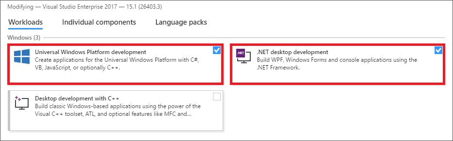

    _Installing the UWP and .NET development workloads_

1. Under "Workloads" in the Visual Studio installer, make sure **Mobile development with .NET** is checked.

    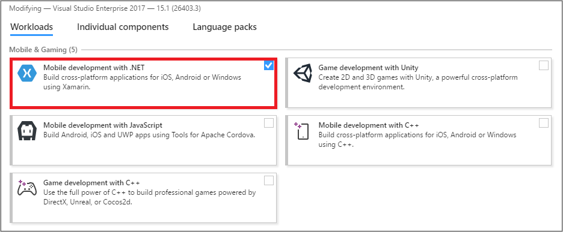

    _Installing the mobile development workload_

1. Under "Individual Components" in the Visual Studio installer, make sure **Visual Studio Emulator for Android** and **Windows 10 Mobile Emulator (Creators Update)** are checked. If you would prefer to use the Google Android emulator instead, you may do so if you choose.

	> If you haven't installed the Windows Creators Update, select the Anniversary Edition instead. If these emulators don't appear as options in the Visual Studio installer, it could because your PC doesn't support virtualization or that virtualization hasn't been enabled. For more information, see https://msdn.microsoft.com/en-us/library/mt228280.aspx.

    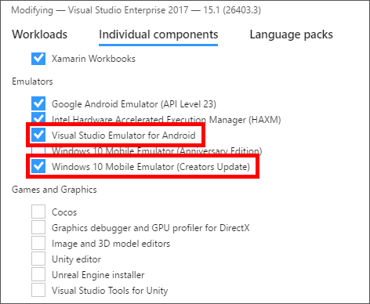

    _Installing emulators_

Once these workloads and components are installed, you are ready to begin creating Xamarin Forms apps.

<a name="Exercise2"></a>
## Exercise 2: Create a Xamarin Forms solution ##

The first step in creating a cross-platform solution with Xamarin Forms is to provision a solution based on the Visual Studio 2017 Cross Platform App template. In this exercise, you will create a new Xamarin Forms solution using this template.

1. Start Visual Studio 2017. Then use the **File** > **New** > **Project** command to create a new Cross Platform App (Xamarin) solution named "DroneLander."

    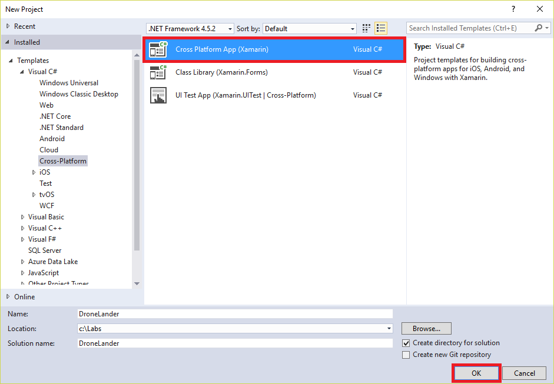

    _Creating a new Cross Platform App solution_

1. In the "New Cross Platform App" dialog, select the **Blank App** template. Make sure **Xamarin.Forms** is selected under "UI Technology" and select **Portable Class Library (PCL)** as the "Code Sharing Strategy." Then click **OK**.

    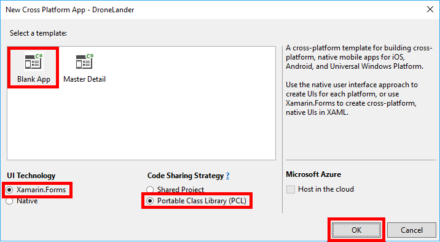

    _Specifying Cross Platform App preferences_

1. When prompted to choose platform requirements for the Universal Windows Platform project, accept the defaults and click **OK**. If you are then prompted to connect to a Mac, simply close the dialog.

	- **NOTE** - if you are using Visual Studio on a Mac you will not be able to create or deploy a UWP project. You will not be prompted to choose platform requirements.

    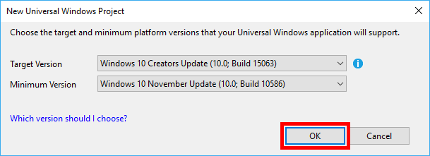

    _Specifying UWP platform versions_

1. Confirm that the solution appears in Solution Explorer and that it contains four projects:
	
	- **DroneLander (Portable)** - Contains shared logic for your  Xamarin Forms app
	- **DroneLander.Android** - Contains assets, resources, and logic specific to Android
	- **DroneLander.iOS** - Contains assets, resources, and logic specific to iOS
	- **DroneLander.UWP (Universal Windows)** - Contains assets, resources, and logic specific to the Universal Windows Platform (UWP)
		- **NOTE** - Visual Studio for Mac will not have **DroneLander.UWP**

	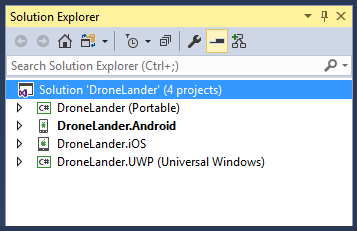
	
	_The generated solution_

1. Right-click the **DroneLander.Android** project in Solution Explorer and select **Properties** from the context menu. Then click **Android Options**, uncheck the **Use Fast Deployment** box, and save your changes. This option, if enabled, sometimes causes problems with Android emulators in Hyper-V. 

    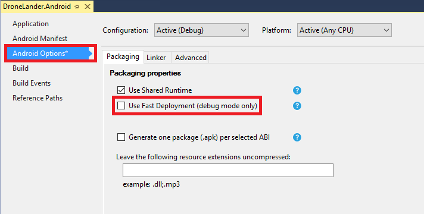

    _Disabling fast deployment on Android_

1. Right-click the **DroneLander.UWP** project and select **Set as StartUp Project** to make it the startup project. Then select **Configuration Manager...** from the **Build** menu. Check the **Build** and **Deploy** boxes for the UWP solution so the UWP app will be built and deployed each time you launch it. Then select **Release** from the **Active solution configuration** drop-down and check these boxes again. Dismiss the dialog by clicking the **Close** button.

    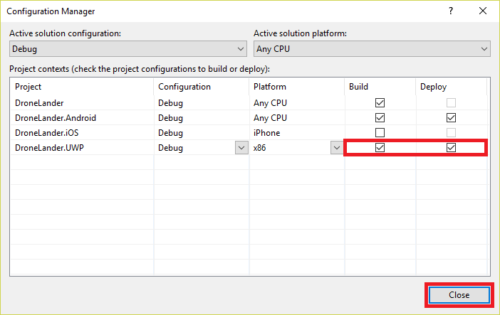

    _Enabling auto-deployment on Windows_

1. **WINDOWS ONLY** Open the Settings app on your PC (an easy way to do it is to click the Windows button, type "Settings," and click **Settings**). Then click **Update & security** followed by **For developers**, and select **Developer mode** if it isn't already selected to make sure you can launch UWP apps from Visual Studio and run them on the local machine.

	> If you try to enable developer mode and receive an error, see https://www.kapilarya.com/developer-mode-package-failed-to-install-error-code-0x80004005-windows-10 for a potential fix.

    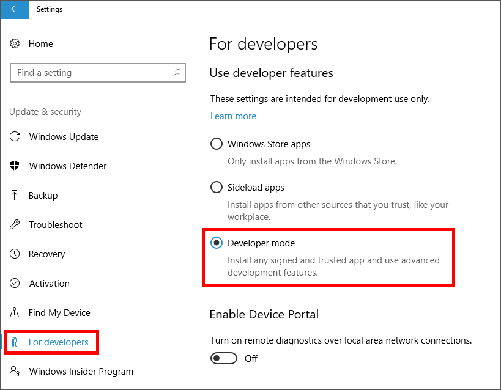

    _Enabling developer mode in Windows 10_

1. Return to Visual Studio and right-click the **DroneLander.Android** project and select **Set as StartUp Project** to make it the startup project.

1. In Solution Explorer, right-click the **DroneLander** solution and select **Build Solution** to build the solution. Confirm that the solution builds without errors.

Your Xamarin Forms solution has now been provisioned and configured, and you're ready to start adding platform-specific image and package assets to the projects.

<a name="Exercise3"></a>
## Exercise 3: Add image and package assets ##

The next step in building your Xamarin Forms app is to add shared and platform-specific images and other assets to the individual projects based on recommended standards for each platform. Each mobile platform requires images and assets to be located and configured in a specific way. In this exercise, you will add images and assets to the Portable, Android, iOS, and Windows projects.

1. Open a Windows File Explorer window and navigate to the "Resources\Droid\Resources" folder included with this lab. Copy all of the subfolders in that folder to the clipboard. Then return to Solution Explorer, right-click the "Resources" folder in the **DroneLander.Android** project, and select **Paste** to paste the contents of the clipboard into the project.

1. In the subsequent "Merge Folders" dialog, check **Apply to all items** and then click **Yes**.
 
    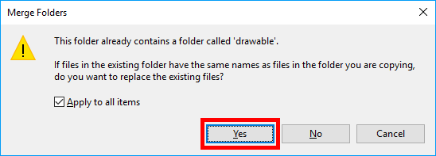

    _Merging  folders_

1. In the "Destination File Exists" dialog, again check **Apply to all items** and click **Yes**. This will update your Android images and assets with appropriately branded assets for your app.

    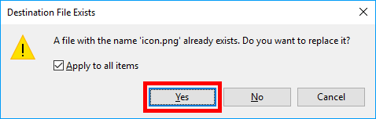

    _Overwriting existing resources_

1. In Solution Explorer, right-click the "Resources" folder in the **DroneLander.iOS** project and use the **Add** > **Existing Item...** command to import all of the files from the lab's "Resources\iOS\Resources" folder.
 
    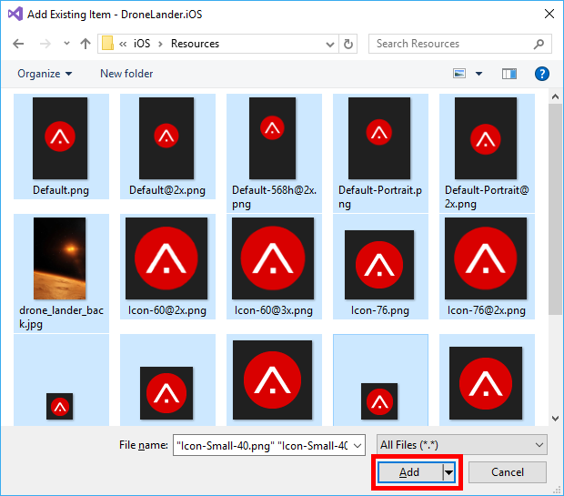

    _Adding images to the iOS project_

1. In the "Destination File Exists" dialog, check **Apply to all items** and then click **Yes**. This will update your iOS images and assets with appropriately branded assets for your app.
 
    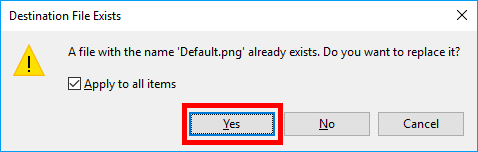

    _Overwriting existing resources_

1. Right-click **Info.plist** in the **DroneLander.iOS** project and select **Open With...** from the context menu. Then select **Generic PList Editor** and click **OK**.

    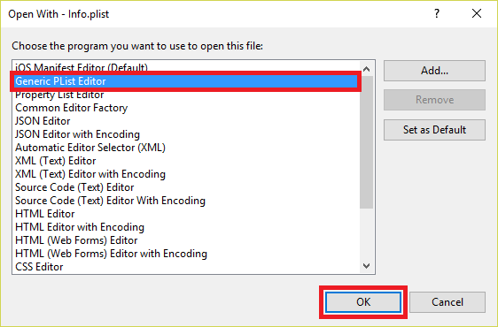

    _Opening Info.plist_

1. Scroll to the bottom of the list, right-click **Launch screen interface file base name**, and select **Delete** to delete this property from the file. Removing this property instructs iOS to use image assets rather than storyboards for launch images.
 
    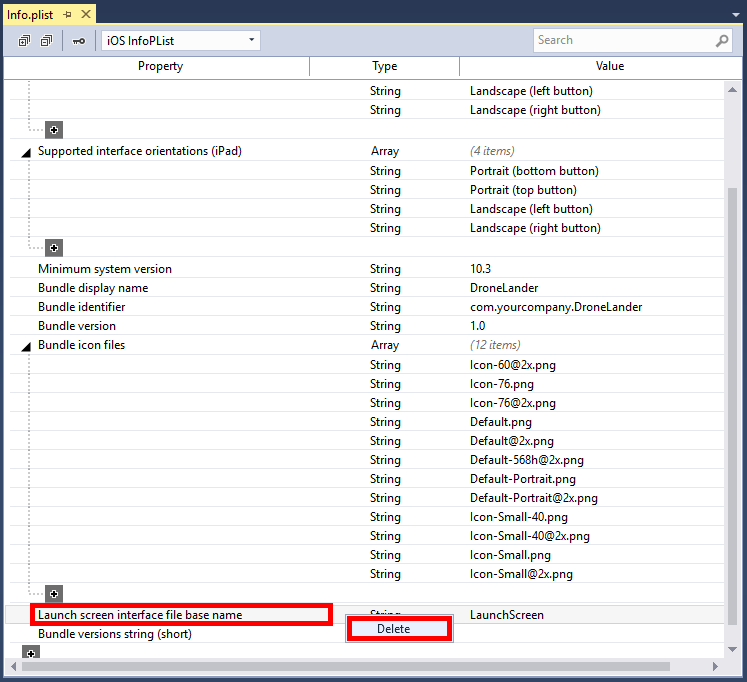

    _Deleting a property from Info.plist_

1. In Solution Explorer, right-click the **DroneLander.UWP** project and use the **Add** > **Existing Item...** command to import the file named **drone_lander_back.jpg** from the lab's "Resources\UWP" folder into the root of the project.

1. Now right-click the "Assets" folder in the same project and use the **Add** > **Existing Item...** command to import all of the files from the lab's "Resources\UWP\Assets" folder.

    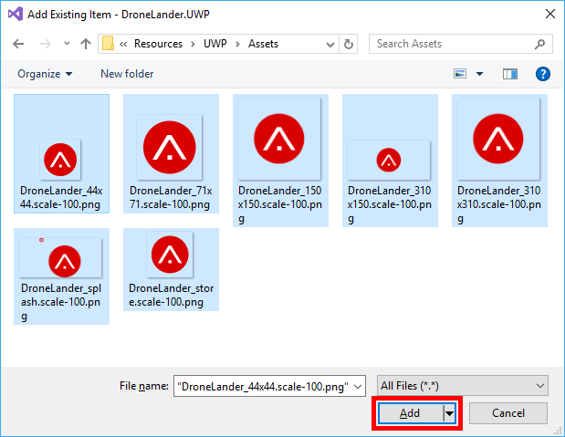

    _Adding images to the Windows project_

1. Right-click **Package.appxmanifest** in the UWP project and select **View Code**. Locate the ```Properties``` element in the XML file. Select that element and all of the statements that follow it. 
 
    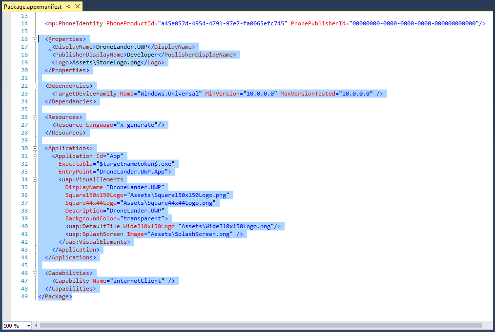

    _Selecting statements in the package manifest_

1. Replace the statements you selected with the following XML to update the manifest file to reference the updated assets.

	```xml
	  <Properties>
	    <DisplayName>Drone Lander</DisplayName>
	    <PublisherDisplayName>Developer</PublisherDisplayName>
	    <Logo>Assets\DroneLander_store.png</Logo>
	  </Properties>
	  <Dependencies>
	    <TargetDeviceFamily Name="Windows.Universal" MinVersion="10.0.0.0" MaxVersionTested="10.0.0.0" />
	  </Dependencies>
	  <Resources>
	    <Resource Language="x-generate" />
	  </Resources>
	  <Applications>
	    <Application Id="App" Executable="$targetnametoken$.exe" EntryPoint="DroneLander.UWP.App">
	      <uap:VisualElements DisplayName="Drone Lander" Square150x150Logo="Assets\DroneLander_150x150.png" Square44x44Logo="Assets\DroneLander_44x44.png" Description="Drone Lander for Windows" BackgroundColor="#212121">
	        <uap:DefaultTile Wide310x150Logo="Assets\DroneLander_310x150.png" Square310x310Logo="Assets\DroneLander_310x310.png" Square71x71Logo="Assets\DroneLander_71x71.png">
	          <uap:ShowNameOnTiles>
	            <uap:ShowOn Tile="square150x150Logo" />
	            <uap:ShowOn Tile="wide310x150Logo" />
	            <uap:ShowOn Tile="square310x310Logo" />
	          </uap:ShowNameOnTiles>
	        </uap:DefaultTile>
	        <uap:SplashScreen Image="Assets\DroneLander_splash.png" BackgroundColor="#212121" />
	      </uap:VisualElements>
	    </Application>
	  </Applications>
	  <Capabilities>
	    <Capability Name="internetClient" />
	  </Capabilities>
	</Package>
	```

1. Now it's time to run the app for the first time. Let's start with the Android version. Ensure that the Android project is selected as the startup project by right-clicking the **DroneLander.Android** project in Solution Explorer and selecting **Set as StartUp Project**.
 
1. Click the **Run** button (the one with the green arrow) at the top of Visual Studio to launch the Android version of Drone Lander in the selected Android emulator. Note that the emulator will probably take a minute or two to start.
 
    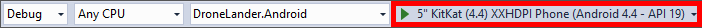

    _Launching the Android app_

1. Confirm that the app appears in the Android emulator. Leave the Android emulator running (that will allow the Android app to start quickly next time). Then return to Visual Studio and select **Stop Debugging** from the **Debug** menu to stop debugging.

    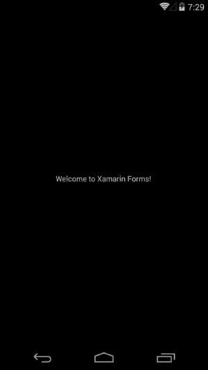

    _Drone Lander on Android_

1. Make **DroneLander.UWP** the startup project by right-clicking it and selecting **Set as StartUp Project**. Then click the **Run** button at the top of Visual Studio to launch the UWP version of Drone Lander on the local machine. Once the app is running, use the **Stop Debugging** command to terminate it.

	> If you would prefer to run the UWP app in a Windows phone emulator rather than on the desktop, simply select the desired emulator from the drop-down list attached to the **Run** button.
 
    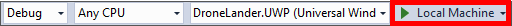

    _Launching the UWP app_

If you go to the home screen in the Android emulator or the start screen in Windows, you should find customized icons for the apps. Customizing the branding in this way is a good first step in building a great Xamarin Forms app that lights up on various platforms.

<a name="Exercise4"></a>
## Exercise 4: Add common logic to the Portable project ##

A common design pattern used in Xamarin Forms solutions is the [Model-View-ViewModel](https://en.wikipedia.org/wiki/Model%E2%80%93view%E2%80%93viewmodel) (MVVM) pattern, which facilitates a clean separation of the business logic and user interface. In this exercise, you will implement a model and a view-model in C# and place them in the Portable project so that they are shared by the iOS, Android, and Windows apps. You will also import some helper classes used by the view-model and by the user interface.

1. In Solution Explorer, right-click the **DroneLander (Portable)** project and use the **Add** > **New Folder** command to add a folder named "Common" to the project. Then repeat this step to add folders named "Models" and "ViewModels" to the project.

1. Right-click the "Common" folder that you just added and use the **Add** > **Existing Item...** (on Mac, **Add** > **Add Files...**) command to import all of the files from the lab's "Resources\Portable\Common" folder. These files contain helper classes that implement commanding and property-binding notifications.

1. Right-click the "Models" folder and use the **Add** > **Class** (on Mac, **Add** > **New File...** > **General** > **Empty Class**) command to add a class file named "LandingParameters.cs" to the folder. Then replace the contents of the file with the following code. This class serves as the data model for information displayed by your app.
 
	```C#
	using DroneLander.Common;
	using System;
	using System.Collections.Generic;
	using System.Linq;
	using System.Text;
	using System.Threading.Tasks;
	
	namespace DroneLander
	{
	    public enum LandingResultType { Landed, Kaboom, }
	    public class LandingParameters
	    {
	        public LandingParameters()
	        {
	            this.Altitude = CoreConstants.StartingAltitude;
	            this.Velocity = CoreConstants.StartingVelocity;
	            this.Fuel = CoreConstants.StartingFuel;
	            this.Thrust = CoreConstants.StartingThrust;
	        }
	
	        public double Altitude;
	        public double Velocity;
	        public double Fuel;
	        public double Thrust;
	    }
	}
	```
1. Right-click the "ViewModels" folder and use the **Add** > **Class** (on Mac, **Add** > **New File...** > **General** > **Empty Class**) command to add a class file named "MainViewModel.cs." Then replace the contents of the file with the following code. The purpose of this class is to provide a view-model containing logic to calculate drone sensor readings, as well as to update UI elements through data binding.
 
	```C#
	using DroneLander.Common;
	using System;
	using System.Collections.Generic;
	using System.Linq;
	using System.Text;
	using System.Threading.Tasks;
	using System.Windows.Input;
	using Xamarin.Forms;
	
	namespace DroneLander
	{
	    public class MainViewModel : Common.ObservableBase
	    {
	        public MainViewModel(MainPage activityPage)
        	{
	            this.ActivityPage = activityPage;
	            this.ActiveLandingParameters = new LandingParameters();	
	            this.Altitude = this.ActiveLandingParameters.Altitude;
	            this.Velocity = this.ActiveLandingParameters.Velocity;
	            this.Fuel = this.ActiveLandingParameters.Fuel;
	            this.Thrust = this.ActiveLandingParameters.Thrust;
	            this.FuelRemaining = CoreConstants.StartingFuel;
	            this.IsActive = false;
	        }
	
	        private MainPage _activityPage;
	        public MainPage ActivityPage
	        {
	            get { return this._activityPage; }
	            set { this.SetProperty(ref this._activityPage, value); }
	        }
	
	        public LandingParameters ActiveLandingParameters { get; set; }
	
	        private double _altitude;
	        public double Altitude
	        {
	            get { return this._altitude; }
	            set { this.SetProperty(ref this._altitude, value); }
	        }
	
	        private double _descentRate;
	        public double DescentRate
	        {
	            get { return this._descentRate; }
	            set { this.SetProperty(ref this._descentRate, value); }
	        }
	
	        private double _velocity;
	        public double Velocity
	        {
	            get { return this._velocity; }
	            set { this.SetProperty(ref this._velocity, value); }
	        }
	
	        private double _fuel;
	        public double Fuel
	        {
	            get { return this._fuel; }
	            set { this.SetProperty(ref this._fuel, value); }
	        }
	
	        private double _fuelRemaining;
	        public double FuelRemaining
	        {
	            get { return this._fuelRemaining; }
	            set { this.SetProperty(ref this._fuelRemaining, value); }
	        }
	
	        private double _thrust;
	        public double Thrust
	        {
	            get { return this._thrust; }
	            set { this.SetProperty(ref this._thrust, value); }
	        }
	
	        private double _throttle;
	        public double Throttle
	        {
	            get { return this._throttle; }
	            set { this.SetProperty(ref this._throttle, value); }
	        }
	
	        private bool _isActionable() => true;
	        private string _actionLabel;
	        public string ActionLabel
	        {
	            get { return this._actionLabel; }
	            set { this.SetProperty(ref this._actionLabel, value); }
	        }
	
	        private bool _isActive;
	        public bool IsActive
	        {
	            get { return this._isActive; }
	            set { this.SetProperty(ref this._isActive, value); this.ActionLabel = (this.IsActive) ? "Reset" : "Start"; }
	        }
	
	        public ICommand AttemptLandingCommand
	        {
	            get
	            {
	                return new RelayCommand(() =>
	                {
	                    this.IsActive = !this.IsActive;
	
	                    if (this.IsActive)
	                    {
	                        StartLanding();
	                    }
	                    else
	                    {
	                        ResetLanding();
	                    }
	
	                }, _isActionable);
	            }
	        }
	
	        public void StartLanding()
	        {
	            Device.StartTimer(TimeSpan.FromMilliseconds(Common.CoreConstants.PollingIncrement), () =>
	            {
	                UpdateFlightParameters();
	                
	                if (this.ActiveLandingParameters.Altitude > 0.0)
	                {
	                    Device.BeginInvokeOnMainThread(() =>
	                    {
	                        this.Altitude = this.ActiveLandingParameters.Altitude;
	                        this.DescentRate = this.ActiveLandingParameters.Velocity;
	                        this.FuelRemaining = this.ActiveLandingParameters.Fuel / 1000;
	                        this.Thrust = this.ActiveLandingParameters.Thrust;
	                    });
	
	                    return this.IsActive;
	                }
	                else
	                {
	                    this.ActiveLandingParameters.Altitude = 0.0;
	                    this.IsActive = false;
	
	                    Device.BeginInvokeOnMainThread(() =>
	                    {
	                        this.Altitude = this.ActiveLandingParameters.Altitude;
	                        this.DescentRate = this.ActiveLandingParameters.Velocity;
	                        this.FuelRemaining = this.ActiveLandingParameters.Fuel / 1000;
	                        this.Thrust = this.ActiveLandingParameters.Thrust;
	                    });
	
	                    if (this.ActiveLandingParameters.Velocity > -5.0)
	                    {
	                        MessagingCenter.Send(this.ActivityPage, "ActivityUpdate", LandingResultType.Landed);
	                    }
	                    else
	                    {
	                        MessagingCenter.Send(this.ActivityPage, "ActivityUpdate", LandingResultType.Kaboom);
	                    }
	
	                    return false;
	                }
	            });
	        }
	
	        private void UpdateFlightParameters()
	        {
	            double seconds = Common.CoreConstants.PollingIncrement / 1000.0;
	
	            // Compute thrust and remaining fuel
	            //thrust = throttle * 1200.0;
	            var used = (this.Throttle * seconds) / 10.0;
	            used = Math.Min(used, this.ActiveLandingParameters.Fuel); // Can't burn more fuel than you have
	            this.ActiveLandingParameters.Thrust = used * 25000.0;
	            this.ActiveLandingParameters.Fuel -= used;
	
	            // Compute new flight parameters
	            double avgmass = Common.CoreConstants.LanderMass + (used / 2.0);
	            double force = this.ActiveLandingParameters.Thrust - (avgmass * Common.CoreConstants.Gravity);
	            double acc = force / avgmass;
	
	            double vel2 = this.ActiveLandingParameters.Velocity + (acc * seconds);
	            double avgvel = (this.ActiveLandingParameters.Velocity + vel2) / 2.0;
	            this.ActiveLandingParameters.Altitude += (avgvel * seconds);
	            this.ActiveLandingParameters.Velocity = vel2;
	        }
			
	        public async void ShakeLandscapeAsync(ContentPage page)
	        {
	            try
	            {
	                for (int i = 0; i < 8; i++)
	                {
	                    await Task.WhenAll(
	                            page.ScaleTo(1.1, 20, Easing.Linear),
	                            page.TranslateTo(-30, 0, 20, Easing.Linear)
	                        );
	
	                    await Task.WhenAll(
	                            page.TranslateTo(0, 0, 20, Easing.Linear)
	                       );
	
	                    await Task.WhenAll(
	                            page.TranslateTo(0, -30, 20, Easing.Linear)
	                       );
	
	                    await Task.WhenAll(
	                             page.ScaleTo(1.0, 20, Easing.Linear),
	                             page.TranslateTo(0, 0, 20, Easing.Linear)
	                         );
	                }
	            }
	            catch { }
	        }

	        public async void ResetLanding()
	        {
	            await Task.Delay(500);
	
	            this.ActiveLandingParameters = new LandingParameters();
	
	            this.Altitude = 5000.0;
	            this.Velocity = 0.0;
	            this.Fuel = 1000.0;
	            this.FuelRemaining = 1000.0;
	            this.Thrust = 0.0;
	            this.DescentRate = 0.0;
	            this.Throttle = 0.0;
	        }
	    }
	}
	```

The Portable project now contains shared logic to support a rich user experience. The next step is to create a user experience utilizing that logic.

<a name="Exercise5"></a>
## Exercise 5: Add a user interface ##

In this exercise, you will add a view to the Portable project and bind it to the view-model to create a user interface. The view will be written in XAML, and like the model and view-model, it will be shared by the iOS, Android, and Windows versions of the app. This is the goal of Xamarin Forms programming: sharing as much UI and logic as possible across platforms by locating them in the Portable project.

> Virtually all Xamarin Forms projects contain some logic and UI elements that are platform-specific. This is one of the most compelling features of Xamarin Forms: that even though most of the code and UI is shared across platforms, you can still leverage platform-specific features of iOS, Android, and Windows to make the app "light up" on each platform.

1. Open **App.xaml** in the Portable project and replace its contents with the following XAML: 

	```xml
	<?xml version="1.0" encoding="utf-8" ?>
	<Application xmlns="http://xamarin.com/schemas/2014/forms"
	             xmlns:x="http://schemas.microsoft.com/winfx/2009/xaml"
	             xmlns:common="clr-namespace:DroneLander.Common;assembly=DroneLander" 
	             x:Class="DroneLander.App">
		<Application.Resources>
	
	        <ResourceDictionary>
	            <common:DecimalDisplayConverter x:Key="DecimalDisplayConverter"/>
	
	            <Style x:Key="CaptionLabelStyle" TargetType="Label">                
	                <Setter Property="TextColor" Value="White" />
	                <Setter Property="Opacity" Value="0.7" />
	            </Style>
	
	            <Style x:Key="DisplayLabelStyle" TargetType="Label">
	                <Setter Property="TextColor" Value="White" />
	                <Setter Property="Margin" Value="0,-15,0,0" />
	                <Setter Property="FontSize" Value="48" />
	            </Style>
	
	            <Style x:Key="ButtonLabelStyle" TargetType="Button">
	                <Setter Property="BorderWidth" Value="0" />
	                <Setter Property="TextColor" Value="White" />
	                <Setter Property="FontSize" Value="20" />
	                <Setter Property="BackgroundColor" Value="Transparent" />
	                <Setter Property="HeightRequest" Value="64" />
	            </Style>
	        </ResourceDictionary>	
		</Application.Resources>
	</Application>
	``` 

	This markup defines several styles used to stylize the app's controls. It also declares an instance of ```DecimalDisplayConverter```, which will be used in **MainPage.xaml** as a value converter. Value converters are components that modify data as it is passed between data sources and data targets during data binding and are widely used in XAML UIs to control output formatting and convert data from one type to another. You imported the ```DecimalDisplayConverter``` class when you imported the files from the lab's "Resources\Portable\Common" folder in Exercise 4, Step 2. Declaring styles, converters, and other resources in **App.xaml** makes them available to all of the application's views. You can also declare resources in the XAML files for individual views, but doing so limits the availability of those resources to the views in which they are declared.

1. Now open **App.xaml.cs** and add the following property declaration above the ```App``` constructor:

	```C#
	public static MainViewModel ViewModel { get; set; }
	```

	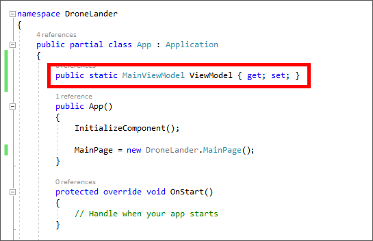

	_Updating the App.xaml.cs file_
 
1. In the ```App``` constructor, replace the statement that initializes the ```MainPage``` property with the following statement: 

	```C#
	MainPage = new NavigationPage(new DroneLander.MainPage());
	```

	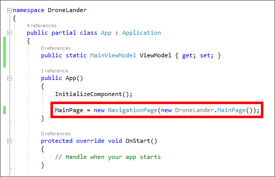

	_Updating the MainPage property in the App contructor_
 
	This statement sets the app's ```MainPage``` property to an instance of ```NavigationPage``` and passes an instance of ```MainPage``` as a parameter. This makes the ```MainPage``` class part of the navigation stack, and also makes it the page that's shown when the app is started.

1. The next task is to replace the placeholder XAML in **MainPage.xaml** with XAML defining the app's user interface. Open **MainPage.xaml** and replace its contents with the following XAML:

	```Xaml
	<?xml version="1.0" encoding="utf-8" ?>
	<ContentPage xmlns="http://xamarin.com/schemas/2014/forms"
	             xmlns:x="http://schemas.microsoft.com/winfx/2009/xaml" Title="Drone Lander"
	             xmlns:local="clr-namespace:DroneLander" 
	             BackgroundImage="drone_lander_back.jpg"
	             x:Class="DroneLander.MainPage">
	  
	    <Grid>
	        <Grid.RowDefinitions>
	            <RowDefinition/>
	            <RowDefinition Height="Auto"/>
	        </Grid.RowDefinitions>
	
	        <StackLayout Padding="40,30">
	            <Label Style="{DynamicResource CaptionLabelStyle}" Text="Altitude (meters)" />
	            <Label Style="{DynamicResource DisplayLabelStyle}" Text="{Binding Altitude, Converter={StaticResource DecimalDisplayConverter}}" />
	
	            <Label Style="{DynamicResource CaptionLabelStyle}" Text="Descent Rate (meters per second)" />
	            <Label Style="{DynamicResource DisplayLabelStyle}" Text="{Binding DescentRate, Converter={StaticResource DecimalDisplayConverter}}" />
	
	            <Label Style="{DynamicResource CaptionLabelStyle}" Text="Thrust (Newtons)" />
	            <Label Style="{DynamicResource DisplayLabelStyle}" Text="{Binding Thrust, Converter={StaticResource DecimalDisplayConverter}}" />
	
	            <Label Style="{DynamicResource CaptionLabelStyle}" Text="Fuel Remaining" />
	            <ProgressBar Progress="{Binding FuelRemaining}" />
	           
	            <Label Style="{DynamicResource CaptionLabelStyle}" Text="Throttle"></Label>
	            <Slider Minimum="0" Maximum="100" Value="{Binding Throttle, Mode=TwoWay}" />
	        </StackLayout>
	
	        <Button Style="{DynamicResource ButtonLabelStyle}" Grid.Row="1" VerticalOptions="Fill" Text="{Binding ActionLabel}" Command="{Binding AttemptLandingCommand}" />
	    </Grid>
	</ContentPage>
	```

	Note the ```Style``` attributes that reference the styles added to **App.xaml**. Also note how ```DecimalDisplayConverter``` is used to format the text output by three of the ```Label``` controls. Without this converter, the Altitude, Descent Rate, and Thrust readouts would include numbers to the right of the decimal point. Internally, ```DecimalDisplayConverter``` calls ```ToString("F0")``` on the value passed to it to remove the decimal point and any values to the right of it.

1. Now open **MainPage.xaml.cs** and replace its contents with the following code:

	```C#
	using System;
	using System.Collections.Generic;
	using System.Linq;
	using System.Text;
	using System.Threading.Tasks;
	using Xamarin.Forms;
	
	namespace DroneLander
	{
	    public partial class MainPage : ContentPage
	    {
	        public MainPage()
	        {  
	            InitializeComponent();
	        }
	
	        protected override void OnAppearing()
	        {
	            base.OnAppearing();
	
	            if (App.ViewModel == null) App.ViewModel = new MainViewModel(this);
	
	            this.BindingContext = App.ViewModel;
	
	            MessagingCenter.Subscribe<MainPage, LandingResultType>(this, "ActivityUpdate", (sender, arg) =>
	            {
	                string title = arg.ToString();
	                string message = (arg == LandingResultType.Landed) ? "The Eagle has landed!" : "That's going to leave a mark!";
	                if (arg == LandingResultType.Kaboom) App.ViewModel.ShakeLandscapeAsync(this);

	                Device.BeginInvokeOnMainThread(() =>
	                {
	                    this.DisplayAlert(title, message, "OK");
	                    App.ViewModel.ResetLanding();
	                });
	            });
	        }

	        protected override void OnDisappearing()
	        {
	            base.OnDisappearing();
	            MessagingCenter.Unsubscribe<MainPage, LandingResultType>(this, "ActivityUpdate");
	        }
	    }
	}
	```

Almost there! The final step is to run Drone Lander and see how it looks on Android and Windows. 

<a name="Exercise6"></a>
## Exercise 6: Test the app ##

In this exercise, you will run the app and practice flying supply missions to Mars. You begin a descent 5,000 meters above the Mars surface. When you click **Start**, the supply drone begins falling. (The gravity on Mars is weaker than the gravity on Earth, but there is gravity nonetheless.) The goal is to touch down on the surface with a downward velocity of 5 meters per second or less. Anything faster, and you dig another crater on the surface of Mars.

You control the descent by adjusting the throttle, which is represented by a ```Slider``` control. More throttle means more thrust and a slower descent rate. Be careful, however. The drone has just enough fuel to arrest your descent and touch down softly if you fly a perfect mission. Use too much throttle too early, and you will run out of fuel and fall the rest of the way to Mars. 

1. Launch the app in the Android emulator and click **Start**. Observe that altitude begins decreasing while the descent rate increases, and it happens in real time.
 
    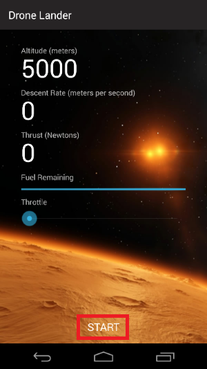

    _Starting a descent in Drone Lander_
 
1. To control the descent rate, you need to apply upward thrust by adjusting the throttle. Slide the throttle slider to the right to increase throttle.

    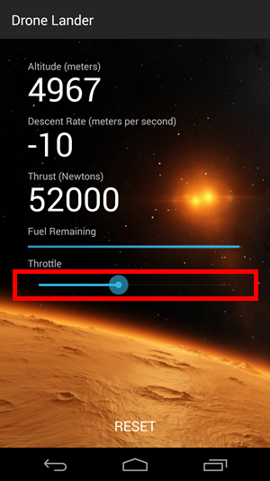

    _Adjusting the drone's throttle_

1. Continue adjusting the throttle to control your descent. Since fuel is a limited resource, you need to practice with the throttle and find a mission profile that enables you to land without running out of fuel. Get it right and you'll be notified that the Eagle has landed. Remember: when altitude reaches zero, you **must have a descent rate of 5 meters per second or less** or else you will crash.

	> Observe that when you crash, the background scenery shakes. That is accomplished using [Xamarin Forms animations](https://blog.xamarin.com/creating-animations-with-xamarin-forms/). Check out the ```ShakeLandscapeAsync``` method added to the solution in Exercise 4, Step 4 to see how it works.

    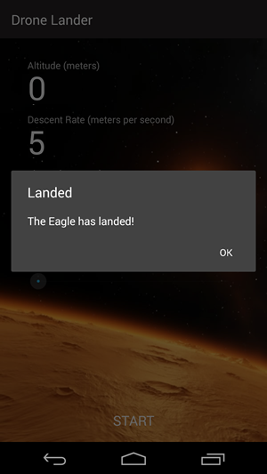

    _Success!_

1. Repeat Steps 1 through 3 for the UWP app and observe how the user experience differs on that platform.

Landing the supply drone is hard. Chances are you will crash the first time, and maybe several times after that. Practice landing it until you can do so successfully most of the time. Later, you will fly **real** supply missions, and every descent will count because there are astronauts depending on your skill to resupply the Mars bases.

<a name="Exercise7"></a>
## Exercise 7 (optional): Add a splash screen to the Android project ##

Have some extra time and want to try an additional challenge? Did you notice that the Android version of the app doesn't have a splash screen? You can implement custom splash screens in iOS and Windows simply by adding assets to the project, but Android apps require a little more effort.

1. In Solution Explorer, right-click the **DroneLander.Android** project and use the **Add** > **New Item...** command to add an activity named "SplashActivity.cs."

	> In Android, an *activity* is a task that interacts with the user. Activities usually, but not always, occupy the entire screen, and are somewhat analgous to *pages* in other platforms such as Windows.

    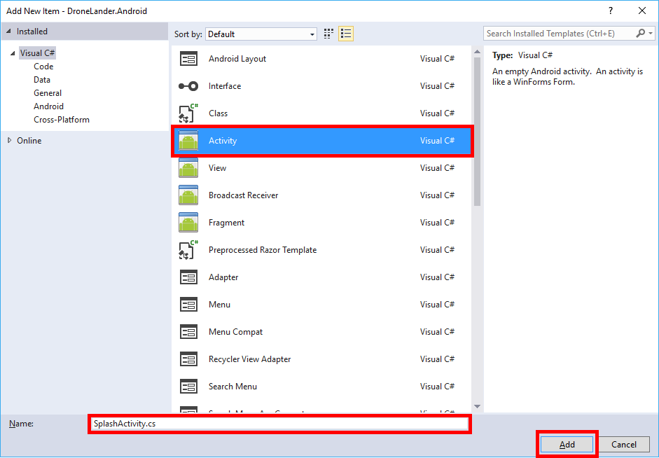

    _Adding an activity to the Android project_

1. Replace the contents of the file with the following code:

	```C#
	using System;
	using System.Collections.Generic;
	using System.Linq;
	using System.Text;
	
	using Android.App;
	using Android.Content;
	using Android.OS;
	using Android.Runtime;
	using Android.Views;
	using Android.Widget;
	using System.Threading.Tasks;
	
	namespace DroneLander.Droid
	{
	    [Activity(Label = "Drone Lander", Theme = "@style/Theme.Splash", MainLauncher = true, NoHistory = true)]
	    public class SplashActivity : Activity
	    {
	        public override void OnCreate(Bundle savedInstanceState, PersistableBundle persistentState)
	        {
	            base.OnCreate(savedInstanceState, persistentState);
	        }
	
	        protected override void OnResume()
	        {
	            base.OnResume();
	
	            Task startupWork = new Task(async () =>
	            {
	                await Task.Delay(300);
	            });
	
	            startupWork.ContinueWith(t =>
	            {
	                StartActivity(new Intent(Application.Context, typeof(MainActivity)));
	            }, TaskScheduler.FromCurrentSynchronizationContext());
	
	            startupWork.Start();
	        }
	    }
	}
	```

	Notice the ```MainLauncher = true``` property in the attribute applied to the ```SplashActivity``` class. This instructs Android to use this class as the "startup" activity for the app. ```Theme = @style/Theme.Splash``` references the ```Theme.Splash``` style that was included in the assets you imported into the Android project in Exercise 3.

1. Now open **MainActivity.cs** and change ```MainLauncher = true``` to ```MainLauncher = false```.

    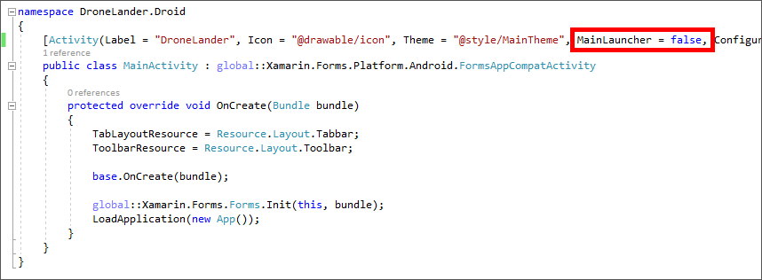

    _Disabling MainLauncher in MainActivity_

1. Run the app in the Android emulator and confirm that it displays the splash screen below.

    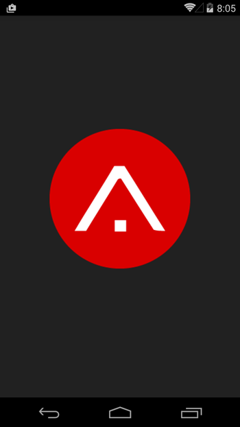

    _The new splash screen_

Developers who are new to Xamarin Forms often wonder what magic is required to customize Android splash screens. It's not hard once you know how. And now you know how!

<a name="Summary"></a>
## Summary ##

The app runs on multiple platforms, but you wrote no platform-specific code. All of the C# and XAML added to the app was added to the Portable project, meaning you achieved 100% sharing of code and UI. Moreover, the app was compiled into native code for each platform you ran it on and is virtually indistinguishable from a native iOS, Android, or UWP app.

That's it for Part 1 of Operation Remote Resupply. In Part 2, you will modify the app to leverage platform-specific features of iOS, Android, and Windows — features that are supported on individual devices but that aren't exposed through Xamarin Forms.