<a name="HOLTitle"></a>
# Operation Remote Resupply, Part 6 #

---

<a name="Overview"></a>
## Overview ##

In Part 4 of Operation Remote Resupply, you used [Visual Studio Mobile Center](https://www.visualstudio.com/vs/mobile-center/ "Visual Studio Mobile Center") to automate the process of building and distributing apps, triggered by commits to GitHub. Although a simple "load test" was performed during this process, automated UI acceptance testing is not currently part of the lifecycle.

In Part 6, you will build on what you did in Part 4 by using the [Xamarin.UITest](https://developer.xamarin.com/guides/testcloud/uitest/) framework and the [Xamarin Test Recorder](https://developer.xamarin.com/guides/testcloud/testrecorder/) to add automated UI tests to the Android version of the Drone Lander app. Once the tests are written, you will submit them to Visual Studio Mobile Center so they're executed automatically every time the app is built. Xamarin.UITest is based on the open-source [Calabash](http://calaba.sh/) framework and features tight integration with Xamarin.Forms, Xamarin.iOS, and Xamarin.Android projects. It exposes a rich API allowing you to simulate button clicks, gestures, and other input, include assertions in your tests, take screen shots, and more. It can even be used with iOS and Android projects written in other languages, including Objective-C, Swift, and Java.

UI acceptance testing is a critical part of the development lifecycle, and is typically at the top of the testing pyramid when it comes to producing robust, bug-free apps. Let's finish up Operation Remote Resupply by adding automated UI testing to Drone Lander and put the "Test" in "Build, Test, and Distribute."

<a name="Objectives"></a>
### Objectives ###

In this lab, you will learn how to:

- Add a Xamarin UI Test project to a Xamarin Forms solution
- Write cross-platform UI acceptance tests
- Use the Xamarin Test Recorder to record test scripts 
- Integrate automated UI tests with Visual Studio Mobile Center

<a name="Prerequisites"></a>
### Prerequisites ###

The following are required to complete this lab:

- [Visual Studio Community 2017](https://www.visualstudio.com/vs/)
- A computer running Windows 10 that supports hardware emulation using Hyper-V. For more information, and for a list of requirements, see https://msdn.microsoft.com/en-us/library/mt228280.aspx. 

---

<a name="Exercises"></a>
## Exercises ##

This lab includes the following exercises:

- [Exercise 1: Add a UI test project to a Xamarin Forms solution](#Exercise1)
- [Exercise 2: Write cross-platform UI test scripts](#Exercise2)
- [Exercise 3: Use the Xamarin Test Recorder to record tests](#Exercise3)
- [Exercise 4: Submit automated UI tests to Visual Studio Mobile Center](#Exercise4)
  
Estimated time to complete this lab: **45** minutes.

<a name="Exercise1"></a>
## Exercise 1: Add a UI test project to a Xamarin Forms solution ##

The first step in incorporating UI tests into a Xamarin Forms app is to add a Xamarin.UITest project to the solution and update a couple of NuGet packages. In this exercise, you will add a test project to the **DroneLander** solution and run a simple test.

1. Open the **DroneLander** solution in Visual Studio 2017.

1. In Solution Explorer, right-click the solution and use the **Add** > **New Project** command to add a **UI Test App (Xamarin.UITest | Cross-Platform)** project named "DroneLander.UITest" to the solution. 
 
	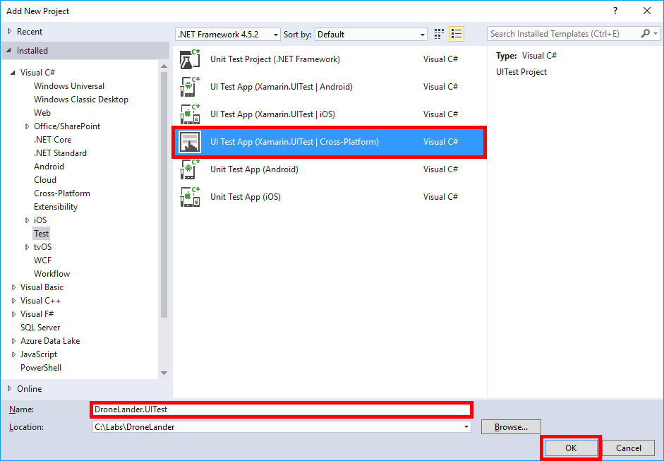

    _Adding a Xamarin.UITest project to the solution_

1. In Solution Explorer, right-click the **DroneLander.UITest** project and select **Manage NuGet Packages...**. Make sure "Installed" is selected. Then select **Xamarin.UITest** and click **Update** to install the latest stable version.

	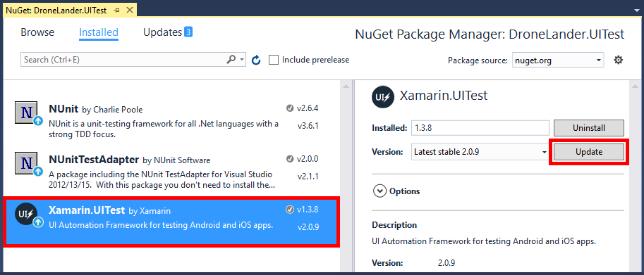

    _Updating Xamarin.UITest_

1. Repeat this process for the NUnitTestAdapter package, updating it to the latest stable version.

	> DO NOT update the NUnit package. Xamarin.UITest requires NUnit version 2.6 and does not work with version 3.0 and higher.

1. Right-click the **DroneLander.Android** project and select **Properties** from the context menu. Select **Android Manifest** and set **Package name** to "com.traininglabs.dronelander" if it isn't set to that already. Then save the modified manifest.

	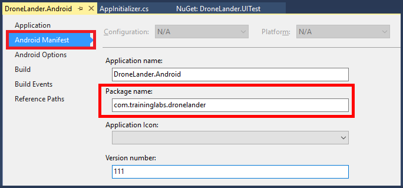

    _Setting the Android package name_

1. Notice the **AppInitializer.cs** and **Tests.cs** files included in the Xamarin.UITest project. **AppInitializer.cs** contains logic for activating platform-specific versions of your app, while **Tests.cs** is where you write your tests.

	Open **AppInitializer.cs** and add the following statement directly above the call to ```StartApp``` in the Android initialization code to connect the test project to the Android version of Drone Lander:

	```C#
	.InstalledApp("com.traininglabs.dronelander")
	```
	 
	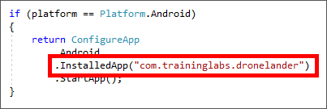

    _Specifying the app package name in the test project_

1. Rebuild the solution. Then open Test Explorer using Visual Studio's **Test** > **Windows** > **Test Explorer** command. Confirm that two tests named "AppLaunches" are displayed. The first is for Android, and the second is for iOS. These are tests that are performed each time the app launches.
	 
	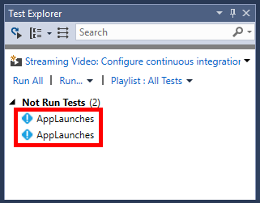

    _AppLaunches tests in Test Explorer_

1. Right-click the first AppLaunches test and select **Open Test** to view the code for the test in **Tests.cs**. Note the ```[Test]``` attribute decorating the ```AppLaunches``` method. This attribute marks a method as a callable entry point for an NUnit test and exposes it to the Xamarin.UITest platform for execution. Other attributes such as ```[StartUp]``` and ```[TearDown]``` are also useful when working with Xamarin.UITest. 

1. When a Xamarin.UITest project is created, the default ```AppLaunches``` method contains a single call to the ```Screenshot``` method, which takes a screen shot of the app.

	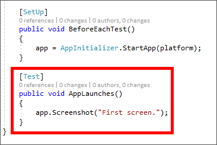

    _The Android AppLaunches method_

	By default, screen shots are not stored locally. To change that, go back to **AppInitializer.cs** and add the following statement after the call to ```InstalledApp``` that you added earlier:

	```C#
	.EnableLocalScreenshots()
	```
	
1. Right-click the first AppLaunches test in Test Explorer and select **Run Selected Tests** to run the test for the Android version of Drone Lander. Then wait until Test Explorer indicates that the test has completed successfully.

	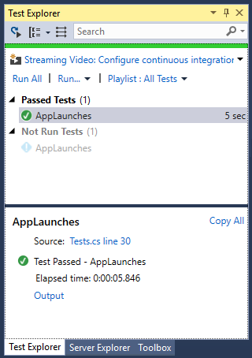

    _A successful test_

1. Screen shots that are saved locally are saved in the build folder in the test project. Right-click the test project and use the  **Open Folder in File Explorer** command to open a File Explorer window. Then navigate to the "bin\Debug" subdirectory and confirm that it contains a screen shot named **screenshot-1.png**.

	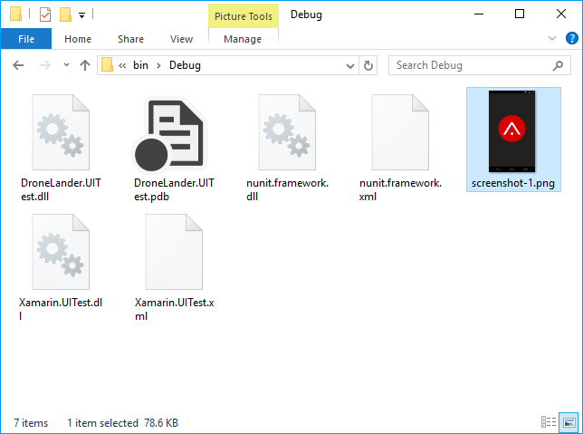

    _The screen shot created during the test run_

You now have a UI test project integrated into your solution. The next step is to add test scripts to the project to do more than just snap a screen shot when the app launches.

<a name="Exercise2"></a>
## Exercise 2: Write cross-platform UI test scripts ##

Xamarin.UITest provides a rich API for implementing sophisticated UI tests. You can simulate button clicks, insert text into entry fields, change the orientation of the device (or emulator), and more. In this exercise, you will add code to the Android AppLaunches test to perform simple actions using just a few of the APIs available in the Xamarin.UITest framework.

1. Open **Tests.cs** in the **DroneLander.UITest** project and replace the code in the ```AppLaunches``` method with the following code:

	```C#
	app.Tap(x => x.Button("Start"));
    app.Screenshot("The app in progress.");
	``` 

	The first line of code simulates a tap of the Start button by querying the UI for a button labeled "Start" and then passing it to the ```Tap``` method. The second line snaps a screen shot after the button is tapped — that is, once the drone has begun descending to the Mars surface.

1. Right-click the first **AppLaunches** test in Test Explorer and select **Run Selected Tests** to run the updated test for the Android version of Drone Lander. Then switch to the Android emulator and watch as Drone Lander loads and the Start button is tapped to begin a descent.

	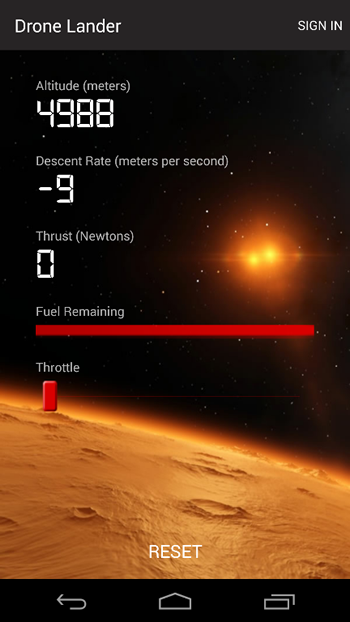

    _A descent initiated by a test script_

1. In Drone Lander, tap **Reset** to end the descent.

1. Navigate back to the test project's "bin\Debug" folder and open **screenshot-1.png**. Confirm that it pictures the app *after* the Start button is tapped.

1. In addition to interacting with elements in the UI, Xamarin.UITest test scripts can interact with the device itself. To demonstrate, add the following statements to the ```AppLaunches``` method in **Test.cs** in the test project, immediately after the call to ```app.Screenshot```:

	```C#
    app.Flash(x => x.Text("Sign In"));
    app.SetOrientationLandscape();
    app.PressVolumeDown();
    app.PressVolumeDown();
    app.SetOrientationPortrait();
    app.Flash(x => x.Button("Reset"));
    app.PressVolumeUp();
    app.PressVolumeUp();
	```

1. Run the Android AppLaunches test again, and switch to the Android emulator to see the automated test in action. When you're done, click **Reset** to stop the descent.

	> Since these steps are automated, they happen quickly. If desired, you could insert calls to  ```Thread.Sleep``` to space them out more. 

You can create sophisticated tests by coding them manually as you did in this exercise. However, what if you could simply "record" your UI tests by interacting with the app, and then later play them back? With the Xamarin Test Recorder, you can do just that.

<a name="Exercise3"></a>
## Exercise 3: Use the Xamarin Test Recorder to record tests ##

Coding UI automation tests by hand is time-consuming and error-prone. The [Xamarin Test Recorder](https://developer.xamarin.com/guides/testcloud/testrecorder/) is a Visual Studio 2017 extension that can record your interactions with an app and create automated tests written in C# based on those interactions. In this exercise, you will install the Xamarin Test Recorder and record UI automation tests that can be run locally or integrated with the app lifecycle using the [Xamarin Test Cloud](https://www.xamarin.com/test-cloud) or Visual Studio Mobile Center.

> The Xamarin Test Recorder is only available in Visual Studio Enterprise 2017. If you are *not* using the Enterprise edition, simply read through this exercise to learn how to use the recorder.

1. Install the Xamarin Test Recorder by using Visual Studio's **Tools** > **Extensions and Updates...** command to display the "Extensions and Updates" dialog, searching for "xamarin test recorder" in the Visual Studio Marketplace, and clicking **Download**.

	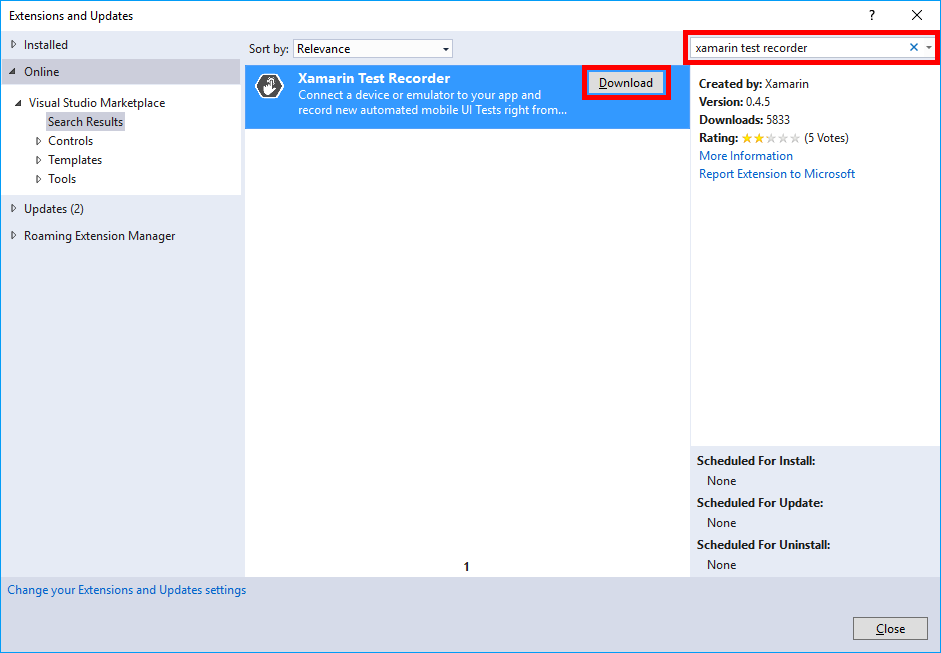

    _Installing the Xamarin Test Recorder_

1. Close Visual Studio 2017 to allow the Xamarin Test Recorder to install, and then reopen the **DroneLander** solution after installation is complete. 

1. Open **Tests.cs** in the **DroneLander.UITest** project and confirm that two icons appear in the left margin. These icons are used to begin recording UI automation tests. The ```[TestFixture]``` attribute indicates that a class contains callable test methods. 

	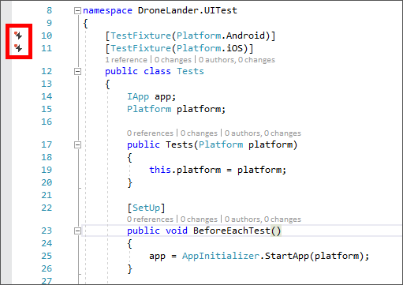

    _The Xamarin Test Recorder icons_

1. The Xamarin Test Recorder can't use the Mono Shared Runtime that is typically used in debug builds. Therefore, change the current build configuration to release mode. Then rebuild the **DroneLander.Android** project to produce a release build.

	

    _Changing the build configuration_

1. Click the record icon to the left of ```[TestFixture(Platform.Android)]``` in **Tests.cs** and select **Record New Test** > **Build DroneLander.Android project** to start a recording session.

	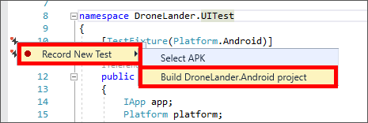

    _Starting a recording session_

1. Wait until the Xamarin Test Recorder begins connecting to the emulator, as pictured below. Then launch the app in the Android emulator.
	
	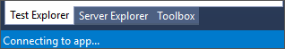

    _Connecting Xamarin Test Recorder to an emulator session_

1. **Wait for the connection status to change from "Connecting to app..." to "Connected".** This may take up to 30 seconds. Then switch to the emulator and perform the following steps in the order shown:

	- Tap **Sign In**
	- Enter the e-mail address for your Microsoft account
	- Tap the **Next** button
	- Enter the password for your Microsoft account
	- Tap the **Sign In** button
	- Tap **Activity** to view landing activity
	- Tap the emulator's back button
	- Tap **Start** to begin a descent
	- Slide the throttle slider all the way to the right
	- Tap **Reset** 
  
1. Return to Visual Studio 2017 and observe that a new method named ```NewTest``` has been created in **Tests.cs** and populated with lines of code corresponding to the actions you just performed. Click the icon to the left of the last line and select **Stop Recording**.

	> Steps related to signing in with your Microsoft account may not have been captured. If that's the case, don't fret; you will fix that in a moment. Capturing these actions often depends on the speed with which the dialogs load and other factors unrelated to Xamarin.UITest.

	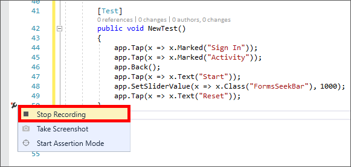

    _Ending the recording session_

1. In Test Explorer, right-click the Android version of NewTest and select **Run Selected Tests** to run the test in the emulator. Then switch to the Android emulator and observe the automated test in action.

	> You can easily determine whether a test method targets Android or iOS by hovering over the test in Test Explorer and inspecting the ensuing tooltip window.

1. When played back, the part of the test in which you sign in with your Microsoft account might not work, and it might even hang. This is because the recording doesn't take into account the time required for pages and dialogs to load. You can fix this by modifying the code generated by the Xamarin Test Recorder. Begin by changing the name of the ```NewTest``` method to something more descriptive such as "SignInAndCheckActivity."

1. If the generated test code generated **does not** include statements referencing the ```WebView``` class, insert the following statements after the first statement in the test method to automate the sign-in process. Substitute your user name and password for YOUR_MICROSOFT_ACCOUNT_EMAIL_ADDRESS and YOUR_MICROSOFT_ACCOUNT_PASSWORD.

	> In production testing scenarios, you will want to create test accounts to use in your tests and avoid using personal accounts.

	```C#
	app.WaitForElement(c => c.WebView().Css("INPUT#i0116"));
    app.EnterText(x => x.WebView().Css("INPUT#i0116"), "YOUR_MICROSOFT_ACCOUNT_EMAIL_ADDRESS");
    app.Tap(x => x.WebView().Css("INPUT#idSIButton9"));
    app.EnterText(x => x.WebView().Css("INPUT#i0118"), "YOUR_MICROSOFT_ACCOUNT_PASSWORD");
    app.Tap(x => x.WebView().Css("INPUT#idSIButton9"));
	```

1. If the generated test code **does** include references to the ```WebView``` class, insert the following statement after the first statement in the test method to wait for the authentication dialog to appear:

	```C#
	app.WaitForElement(c => c.WebView().Css("INPUT#i0116"));
	```

	The ```WaitForElement``` method provides an easy-to-use mechanism for delaying until a condition involving a UI element is satisfied. In this example, it waits for the authentication dialog to render in the ```WebView``` control.

1. Since the Test Recorder doesn't record the delays between actions, it's often helpful to force a delay in a script, or wait for a UI element to become available before moving to the next step. You may have noticed, for example, that the generated code immediately goes back to the previous page after navigating to the landing-activity page.

	To compensate, insert the following statement after the statement that simulates a tap of the Activity button to wait for the text string "Kaboom" to appear on the page:

	```C#
	app.WaitForElement(x => x.Text("Kaboom"));
	```

1. Since your recording includes a tap of the Reset button following the increase in throttle, you should introduce a delay before the Reset button is tapped to allow the landing simulation to run for a period of time. To that end, add the following statement after the statement that changes the value of the Slider control:

	```C#
	 System.Threading.Thread.Sleep(2000);
	```

1. Rebuild the **DroneLander.UITest** project so the new test methods appear in Test Explorer.

	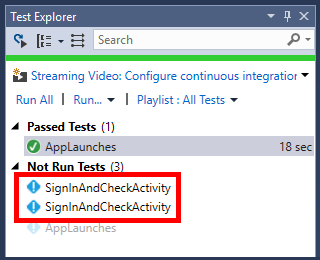

    _The updated test methods in Test Explorer_

1. Run the Android version of the test. Then switch to the Android emulator and watch the test execute. Confirm that the test executes successfully and that Test Explorer indicates that the test passed.  

	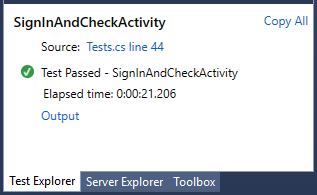

    _A successful test_

Automating UI tests in this manner by using the Xamarin Test Recorder to record your actions and, when necessary, modifying the code that it generates reduces the amount of effort required to incorporate UI tests into the development process. The next step is to run the tests that you create on real hardware, and not just on hardware you own, but on a variety of devices. Only then can you be reasonably assured that your app is robust enough for real-world use.

<a name="Exercise4"></a>
## Exercise 4: Submit automated UI tests to Visual Studio Mobile Center ##

It probably isn't realistic for you to collect hundreds of devices on which to run your tests. Even if you could, the process of running them one by one would be painstaking unless that process, too, were automated.

Both the [Xamarin Test Cloud](https://www.xamarin.com/test-cloud) and Visual Studio Mobile Center can solve this problem by enabling you to run the automated tests that you create on hundreds of devices. In this exercise, you will add the **DroneLander.UITest** project to the GitHub repo that you created earlier and integrate the automated tests into the app lifecycle using Visual Studio Mobile Center.

1. Open **Tests.cs** in the **DroneLander.UITest** project and replace the code in the ```SignInAndCheckActivity``` method with the following code:

	```C#
	app.Tap(x => x.Text("Start"));
    app.SetSliderValue(x => x.Class("FormsSeekBar"), 1000);
    System.Threading.Thread.Sleep(2000);
    app.Screenshot("Drone Lander in action");
    app.Tap(x => x.Text("Reset"));
	```

	> Since many third-party authentication services, including Microsoft's, often require two-factor authentication or secondary forms of validation, you are removing the code that signs in with a Microsoft account to avoid any "false failures" during test runs.
	
1. Delete the ```AppLaunches``` method (including the ```[Test]``` attribute decorating it) from **Tests.cs**. You no longer need it since the ```SignInAndCheckActivity``` method starts a descent and takes a screen shot. 
	
1. Ensure that the build configuration is still set to release mode in Visual Studio. Then right-click the **DroneLander.Android** project and use the **Archive...** command to create a release version of the project package.

1. Add the **DroneLander.UITest** project to your GitHub repo by clicking the changes indicator in the lower-right corner of the Visual Studio status bar, entering a commit message such as "Added test project," and selecting **Commit All and Push**.

	

    _Adding the test project to the repo_

1. Recall that any new commits to the GitHub repo will automatically trigger the build and distribution process. Xamarin.UITest is designed to seamlessly integrate into this process and perform the Test portion of a Build/Test/Distribute lifecyle.

	Go to [Visual Studio Mobile Center](https://mobile.azure.com/apps) in your browser and select the Android version of Drone Lander. Then click **Test**. 
 
	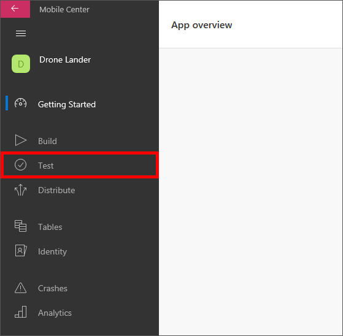

    _Configuring tests in Visual Studio Mobile Center_

1. Click **Try Automated UI Testing**. Then click **Test series** in the upper-right corner of the page, and click **Create new series**.

	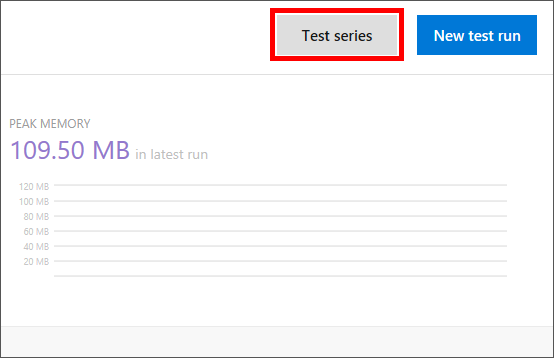

    _Creating a new test series_

1. Enter "UI Acceptance Series" as the series name, and then click **Create**.

	

    _Naming the test series_

1. Close the "Test Series" dialog to return to the Mobile Center Test page, and then click **New test run**.

1. Select the device you want to use for testing, and then click **Select (1) device** at the bottom of the screen.

	> You are only testing on one device to make testing as quick as possible, but if you weren't concerned about time, you could select as many devices as you want.

	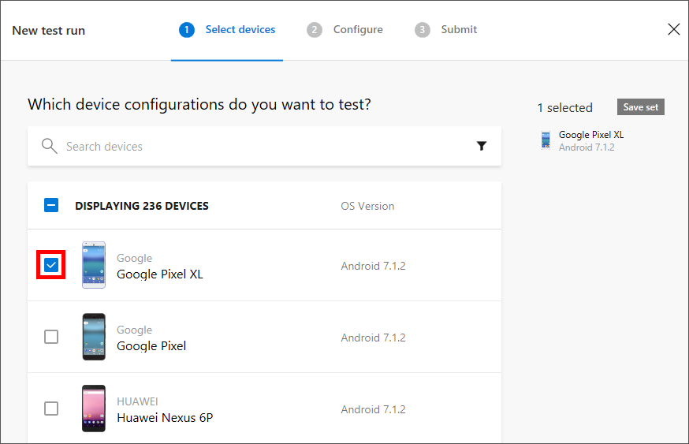

    _Selecting a target device_

1. Select **UI Acceptance Series** as the test series and **Xamarin.UITest** as the test framework. Then click **Next**.

	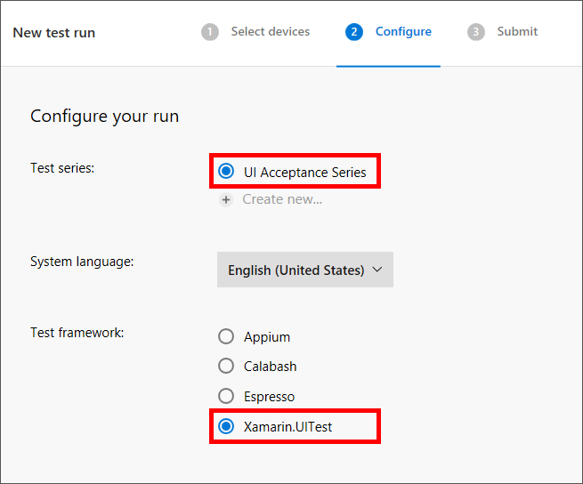

    _Specifying the test series and test framework_

1. Review the information presented to you. **Perform steps 1 and 2** in the "Prerequisites" section to ensure that [Node.js](https://nodejs.org/) and the [Mobile Center CLI](https://docs.microsoft.com/en-us/mobile-center/cli/) are installed.   

	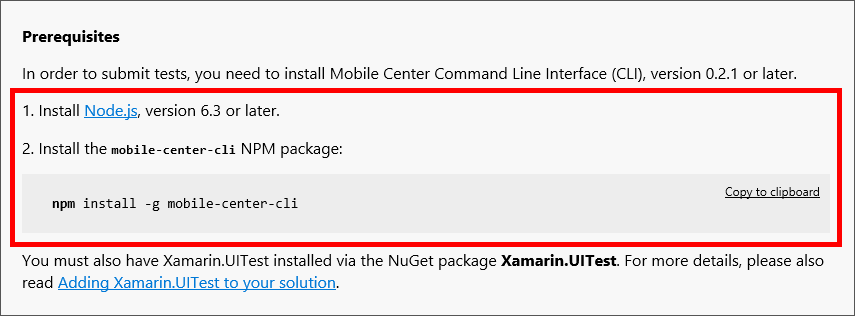

    _Prerequisites for submitting tests_

1. Click **Copy to clipboard** in the "Running tests" section to copy the Mobile Center CLI command to the clipboard.

	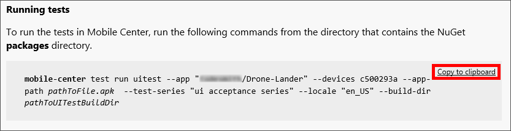

    _Copying the Mobile Center CLI command to the clipboard_

1. This command needs to be run from the "packages" folder located in the root of the DroneLander solution. To get the location of that folder, right-click the solution in Solution Explorer and select **Open Folder in File Explorer**.

1. Open a Command Prompt window and type "cd " (notice the trailing space). Then drag the "packages" folder from the File Explorer window to the Command Prompt window and press **Enter** to change to the "packages" directory.

1. Paste the command on the clipboard into the Command Prompt window, but don't execute the command just yet.

1. Replace *pathToFile.apk* in the command you pasted in with the following path name. This is the path to the release-mode Android package that you archived:

	```
	"..\DroneLander\DroneLander.Android\bin\Release\com.traininglabs.dronelander.apk"
	``` 

1. Replace *pathToUITestBuildDir* with the following path name. This is the Xamarin.UITest build directory:

	```
	"..\DroneLander.UITest\bin\Release"
	```

1. Press **Enter** to execute the command and submit your acceptance tests.

	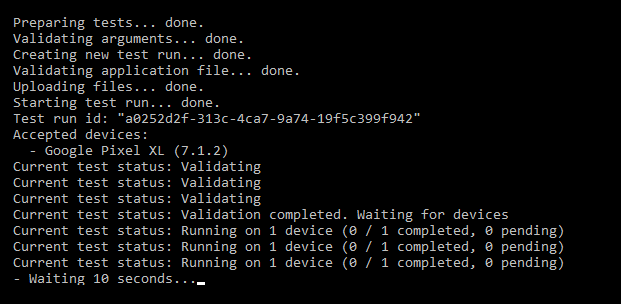

    _Submitting acceptance tests_

1. Return to the Test page for the Android version of Drone Lander in Mobile Center and confirm that a test has been started.

	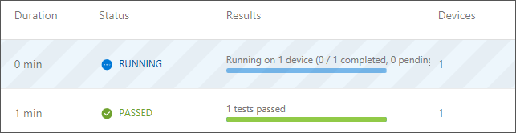

    _Viewing the test status_

1. Since Mobile Center is running your automated UI tests on a real device, this process could take **10 to 15 minutes to complete**. Wait until the status changes to "PASSED", and then click the test to view the results.

	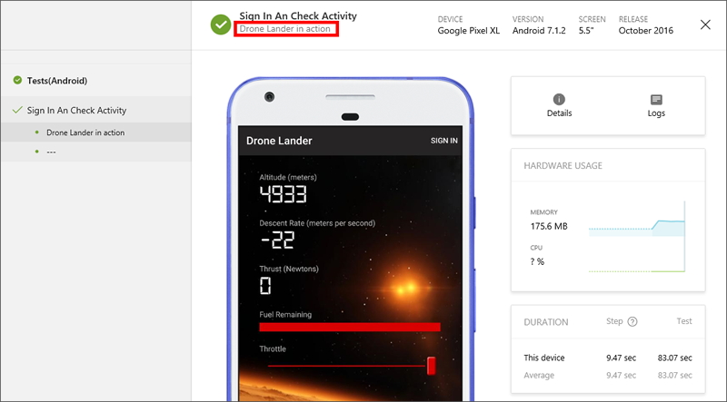

    _Viewing the test results_

For more detailed information about test runs on specific devices, you can click **Details** and **Logs** to view device specifications, test logs, and stack traces.

<a name="Summary"></a>
## Summary ##

The development lifecycle is now complete and fully automated. The tests you created in this lab, although simple, can serve as a starting point for more rigorous UI acceptance tests. For more information about Xamarin.UITest as well as its features and capabilities, see https://developer.xamarin.com/guides/testcloud/uitest/intro-to-uitest/.