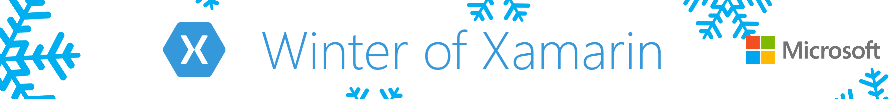

# How to Run This Final Solution to Win! #

This guide will help you us the sample project in this folder that you can use to modify and enter the competition.

1. If you need help installing Xamarin, follow the instructions [mentioned here](../Preperation/README.md).
2. Clone this repo on your machines `git clone https://github.com/ovishesh/Winter-of-Xamarin.git` or download zip.
3. Navigate to the **Final Solution** folder and open the DroneLander.sln file in Visual Studio 2017.
4. `Build` the solution, set your desired platform project as a `Startup Project` and run the app.

Advanced - Complete [Module 5 Xamarin and Azure Mobile Apps](../5.%20Xamarin%20and%20Azure%20Mobile%20Apps/) and create your own Backend in Azure.

If any issues, you can log them on the [Issues tab](https://github.com/ovishesh/Winter-of-Xamarin/issues).

More information about the events and competition - [http://aka.ms/winterofxamarin](http://aka.ms/winterofxamarin)